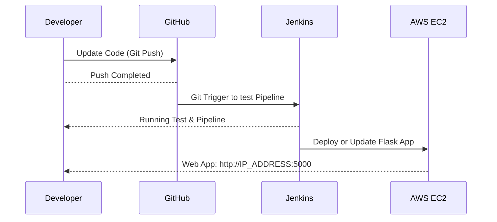

# DevOps Test - ADDI!

ADDI wants to deploy a new service (API) for their customers, this API allows the customer to know how much money is in their account at any moment. The engineering team needs to deploy this API in a productive environment. They need this service to be deployed in a highly available architecture, and they also want to be able to have observability over the API behavior. There are no budget constraints.

To solve the above problem, I've created an architecture based on AWS recommendations and good practices. You can find all the information, files and code on this [GitHub](https://github.com/jaimevlz/devops-test).

> Image 1. Architecture

# Architecture

### **Why I use that architecture?**
First of all, Terraform is a tool for developing, changing and versioning infrastructure safely and efficiently, that's the reason why I use terraform as a tool of infraestructure as code to deploy the solution. Jenkins is used to build and test your software projects continuously making it easier for developers to integrate changes to the project through pipelines. Nginx is a very efficient HTTP load balancer to distribute traffic to several application servers and to improve performance, scalability and reliability of web applications. Docker + Flask as web application make your deployment easier. And a containerized PostgreSQL as Database. Each of the stages is explained below.

## 1. Terraform

To deploy Jenkins as a CI/CD tools with a tool of infraestructure as code. Into main.tf file declare the security group to create the network interfaces and give permisions to allow the access through internet.


In this part of the document select the server image (Ubuntu 20.04 Server) to deploy in AWS EC2 service.


In this part of the code using the tool "remote-exec" of terraform, deploy, supply and configure the server jenkins, open the port to access using the port 8080 and install docker, to run and initialize the web app services using the pipeline.


## 2. Jenkins
Once finished the terraform deploy usign "terraform apply" proccess. start configuring the Jenkins server. To start using jenkins using the AWS Cloud9 shell terminal, log in to the Jenkins CI server, unlock the server and install all the plugins needed.


### Jenkinsfile and Pipeline Setup.
To configure and setup the pipeline is necessary install the plugins:
1. Docker
2. Docker Pipeline
3. GitHub Authentication
4. GitHub Integration
5. AWS EC2 Integration

Also it's necessary create a Jenkinsfile and setup the Pipeline and the connection to GitHub using SCM through the jenkins Wizard. The Jenkinsfile for the pipeline looks like:


Jenkins Link to Access: http://54.185.237.254

## 3. GitHub
After configuring Jenkins, it's time to configure GitHub so that when the code is updated by a developer Jenkins run the pipeline and deploy the updates using Spinnaker pipelines and pipelines triggers.

### Pipeline - GitHub Interaction


## 4. Web App API - Flask - Python PostgresSQL

To deploy the Flask App:

Into requirements.txt file needs to put all the imports to install using "pip install -r requirements.txt". Into de src folder to create de data base and deploy the app it's necessary use the following commands.
```

sudo -u postgres createuser --superuser ubuntu
sudo -u ubuntu createdb addi_db
sudo apt-get install software-properties-common
sudo apt-get -y install python3-pip build-essential python3-dev
pip3 install virtualenv
cd python-deploy-terraform
virtualenv env
source env/bin/activate
export APP_SETTINGS=config.DevelopmentConfig
export DATABASE_URL=postgresql:///addi_db
pip3 install -r requirements.txt
python3 manage.py db init
python3 manage.py db migrate
python3 manage.py db upgrade
gunicorn --bind 0.0.0.0:5000 app:app
```
## Conclusion
The test was too interesting because tested the my skills to learn, research and apply a new tool. Also the test was difficult beacause every single part of the architecture works separatly but when I tried to do a one click deployment nothing works.I learn how to create a basic pipeline and run the pipeline with a push or commit new in the github repository. I learn how to deploy a server on AWS EC2 service using a tool of infraestructure as a code like terraform. And also learn about Flask App integration with a Database.
